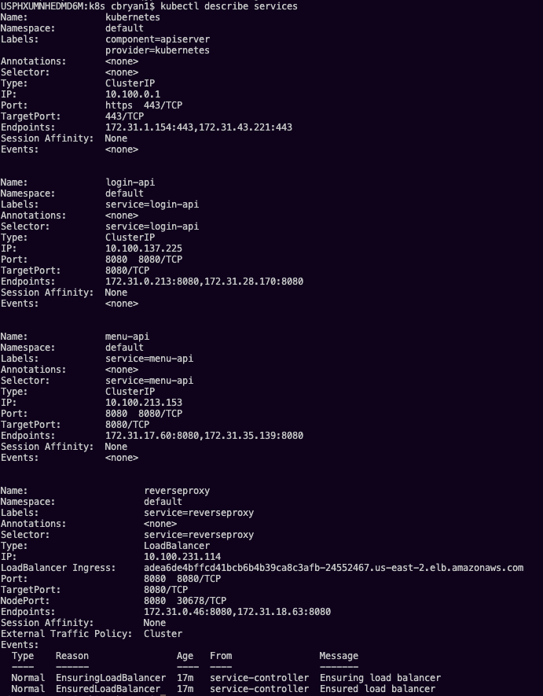

# cb3-capstone-deployment

## Overview of project
I have decided to try and do another api in EKS. I used MongoDB instead, with the cloud option that Mongo gives out, as I have been wanting to try out mongoDB! I had Travis CI for the deployment. I also decided to dive deeper into docker useage and I created a local docker-compose file in the file *localInstance*. I actually got to use a cool feature that waits to run the api's until the mongodb database container is running. Awesome! I deployed into EKS, and used a reverse proxy. Between going further into Docker and using mongoDB, I really got to branch out for this project. I also got to harden my skills with EKS and will be using it in my career for sure, seeing how easy it is redeploy apps! I also added postman collections in this repo with both local environments when you run the docker compose and the deployed one in AWS world. I also did unit testing with Jest on both of my api's so if you download those repos and run the command "npm run test" you will see the complete code coverage (minus one branching path that I decided to leave, as it was giving me trouble with not sending all req.body fields even though it doesnt need it, as you will see it works when integration testing). I also figured out how to configure a mongodb memory server package for jest so I could unit test easily with my API calls!

It was great really getting to touch all these different moving parts!

The instructions said I only had to do 3 requirements, but I have done more, and I made sure to do Unit and Integration testing and left them here. All k8s deployment stuff is in the k8s file.

## Code Repos: 

1. Menu-API: https://github.com/CurtBryan/cb3-menu-api

1. Login-API: https://github.com/CurtBryan/cb3-login-api

## Screenshots:

### DOCKER IMAGES

### TRAVIS CI

### MONGODB 

### K8S PODS

### K8S SERVICES

### K8S LOGIN API LOGS

### K8S MENU API LOGS

